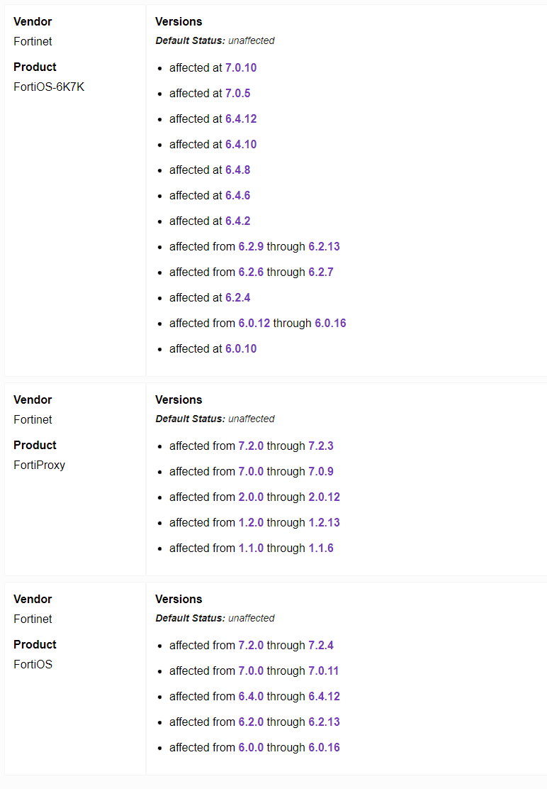
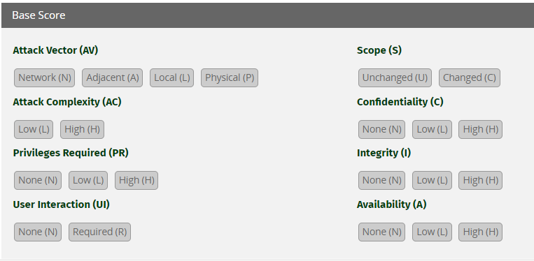
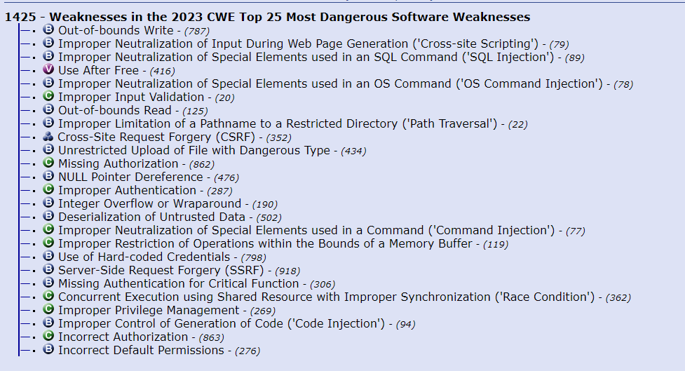
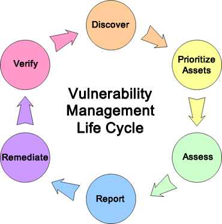

- [BUT](#but)
- [DEFINITION D'UNE VULNERABILITE](#definition-dune-vulnerabilite)
  - [QUELQUES TERMES A CONNAITRE CONCERNANT LES VULNERABILITES](#quelques-termes-a-connaitre-concernant-les-vulnerabilites)
    - [EOL - END OF LIFE](#eol---end-of-life)
    - [CVE](#cve)
    - [SCORE CVSS](#score-cvss)
      - [CVSS EN UNE LIGNE](#cvss-en-une-ligne)
    - [CWE](#cwe)
    - [NVD](#nvd)
    - [0-DAY](#0-day)
    - [KEV](#kev)
    - [EPSS](#epss)
- [EXERCICE PRATIQUE - LECTURE D'UNE CVE FORTI DE JUIN CVE CVE-2023-27997](#exercice-pratique---lecture-dune-cve-forti-de-juin-cve-cve-2023-27997)
- [VULNERABILITY MANAGEMENT LIFECYCLE](#vulnerability-management-lifecycle)
  - [DISCOVER](#discover)
  - [PRIORITIZE](#prioritize)
  - [ASSESS](#assess)
  - [REPORT](#report)
  - [REMEDIATE](#remediate)
    - [GESTION DU RISQUE](#gestion-du-risque)
      - [ACCEPTATION DU RISQUE](#acceptation-du-risque)
    - [REFUS DU RISQUE](#refus-du-risque)
    - [REPORT DU RISQUE](#report-du-risque)
    - [ANNULATION DU RISQUE](#annulation-du-risque)
  - [VERIFY](#verify)
    - [TOOL - OPENVAS](#tool---openvas)
    - [TOOL - NMAP](#tool---nmap)
    - [TOOL - WAZUH (link to LD post)](#tool---wazuh-link-to-ld-post)

# BUT
Dans cet article, nous allons voir ensemble comment gérer les vulnérabilités présentes au sein de votre parc informatique. Que vous soyez technicien, manager en devenir, administrateur, etc., comprendre comment adresser les vulnérabilités dans l'entreprise peut permettre de comprendre certaines décisions.
# DEFINITION D'UNE VULNERABILITE
Citons Wikipedia : Dans le domaine de la sécurité informatique, une vulnérabilité ou faille est une faiblesse dans un système informatique permettant à un attaquant de porter atteinte à l'intégrité de ce système, c'est-à-dire à son fonctionnement normal, à la confidentialité ou à l'intégrité des données qu'il contient.

Plusieurs points à retenir :

- La faiblesse peut être d'origine humaine (ex: ingénierie sociale, mots de passe réutilisés), technique (ex: logiciel non à jour, configuration incorrecte) ou encore architecturale (ex: mauvaise segmentation, absence de redondance d'un service critique).
- Elle doit permettre de porter atteinte à au moins l'un des facteurs suivants :
  - Confidentialité : seules les personnes nécessaires ont accès à la donnée.
  - Intégrité : seules les personnes ou processus autorisés peuvent modifier la donnée.
  - Disponibilité : l'information est disponible dès que nécessaire et sans délai.
- La faiblesse peut être exploitée par un attaquant, qu'il soit interne ou externe, de manière intentionnelle ou non.

Cela signifie que si l'on diminue au moins l'un de ces facteurs, la menace que représente la vulnérabilité sera diminuée.
## QUELQUES TERMES A CONNAITRE CONCERNANT LES VULNERABILITES
Il y a quelques termes a connaitre et comprendre lorsque l'on parle de vulnérabilités.
### EOL - END OF LIFE
La première vulnérabilité qui nous vient à l'esprit est la fin de support (End Of Life en anglais). Vous rencontrerez forcément au moins une fois cette vulnérabilité dans votre vie professionnelle.

Cela peut aller du téléphone Android qui ne reçoit plus de correctifs, au [au système d'exploitation d'un autre temps](https://www.lemonde.fr/pixels/article/2015/11/11/une-panne-informatique-a-l-aeroport-d-orly-liee-a-windows-3-1_4807479_4408996.html), en passant par le logiciel industriel "qui fonctionne et dont le remplacement coûterait trop cher"."

Un bon début pour surveiller obsolescence de votre parc est d'utiliser [ce site](https://endoflife.date) en liaison avec votre CMDB.
### CVE
CVE (Common Vulnerabilities and Exposures) : désigne une liste publique de failles de sécurité informatique. Elle fournit un identifiant unique pour chaque faille sous la forme CVE-YEAR-UniqueID.

Cette liste est maintenue par le [MITRE](https://www.mitre.org) avec le soutient du Département de la Sécurité Intérieure des Etats-Unis.

Son objectif est d'identifier, de définir et de cataloguer les vulnérabilités en matière de cybersécurité divulguées *publiquement*.

Lorsque vous êtes alerté de la présence de CVE dans votre parc il faut bien comprendre que vous n'avez que le strict minimum en terme d'information. Rien de technique, uniquement le logiciel ciblé, la version ciblée et la version corrective si existante.

Exemple : 

### SCORE CVSS
Le score CVSS (Common Vulnerability Scoring System) fournit une note de dangerosité (et non de risque) sur 10. 10 étant la note maximale.

| Score | Risque |
|:-----:|:------:|
| 0     | Nul    |
| 0.1 à 3.9 | Faible |
| 4 à 6.9   | Moyen  |
| 7 à 8.9   | Elevé  |
| 9 à 10   | Critique |

La norme CVSS est gérée par l'organisme [FIRST.Org](https://www.first.org).

La note prend en compte plusieurs vecteurs comme : 
- Le vecteur d'attaque,
- La complexité d'attaque,
- Les privilèges requis pour réussir l'attaque,
- Est-ce qu'une interaction utilisateur est requise.

#### CVSS EN UNE LIGNE
Dans une optique "optimisation" il est rare de voir un tableau complet dans les bulletins d'alertes, le plus souvent vous trouverez une liste de caractères qui résume ce tableau.

Exemple : CVSS:3.1/AV:N/AC:L/PR:N/UI:R/S:C/C:L/I:L/A:N résume le tableau suivant :

Chaque partie est donc résumé via les initiales.
- AV:N = *A*ttack *V*ector : *N*etwork
- AC:L = *A*ttack *C*omplexity : *L*ow
- etc...

Pour découvrir un peu plus ce système : [Common Vulnerability Scoring System Version 3.0 Calculator](https://www.first.org/cvss/calculator/3.0)
### CWE
CWE (Common Weakness Enumeration) : désigne une liste publique des vulnérabilités que l'on peut rencontrer dans les logiciels.

Cette liste est maintenue par le [MITRE](https://www.mitre.org) avec le soutient du Département de la Sécurité Intérieure des Etats-Unis.

CVE se concentre sur l'identification et la référence des vulnérabilités spécifiques dans les logiciels et les systèmes, tandis que CWE se concentre sur les faiblesses communes dans les pratiques de développement et de codage qui peuvent conduire à des vulnérabilités.

Exemple : 

### NVD
NVD (National Vulnerability Database) est le référentiel du gouvernement américain pour les données de gestion des vulnérabilités basées sur des normes et représentées à l'aide du protocole SCAP (Security Content Automation Protocol). Ces données permettent d'automatiser la gestion des vulnérabilités, la mesure de la sécurité et la conformité. 
Le NVD comprend des bases de données de références de listes de contrôle de sécurité, de failles logicielles liées à la sécurité, de configurations erronées, de noms de produits et de mesures d'impact.

Typiquement, avec Power Automate ce type de ressource permet de gagner du temps dans le traitement quotidien de vos alerte.
[Lien vers la documentation](https://powerautomate.microsoft.com/fr-FR/connectors/details/shared_nistnationalvulnerip/nist-nvd-independent-publisher/)
### 0-DAY
Une faille "0-day" fait référence à une vulnérabilité dans un logiciel qui est inconnue de l'éditeur du logiciel ou de la communauté en général. 
Cela signifie que les développeurs de logiciels ne sont pas encore au courant de cette vulnérabilité et qu'aucun correctif n'a été publié. Par conséquent, les attaquants peuvent exploiter cette faille sans que des mesures de défense appropriées soient disponibles. Le terme "0-day" fait référence au fait que l'attaque a lieu le jour même où la vulnérabilité est découverte, sans qu'il y ait eu de temps pour corriger ou patcher le logiciel.
### KEV
KEV (Known Exploited Vulnerability) désigne une vulnérabilité connue qui est actuellement exploitée par des attaquants. 
Dans ce cas, la vulnérabilité a déjà été découverte et signalée, et il est possible que des correctifs ou des mises à jour aient été publiés pour résoudre le problème. Cependant, malgré cela, certains systèmes n'ont pas encore appliqué ces correctifs, et les attaquants exploitent activement la vulnérabilité pour compromettre ces systèmes non protégés.

Pour être tenue informé des KEV, je vous invite à vous abonner à [ce site](https://www.cisa.gov/known-exploited-vulnerabilities-catalog)

Exemple : 

### EPSS
EPSS (Exploit Prediction Scoring System) est un système basé sur des données qui permet d'estimer la probabilité qu'une vulnérabilité logicielle soit exploitée dans la nature.  Le modèle EPSS produit une note de probabilité comprise entre 0 et 1 (0 et 100 %). Plus le score est élevé, plus la probabilité qu'une vulnérabilité soit exploitée est grande.
Ce système est originaire du FIRST, le même organisme que pour CVSS.

*En annexe vous trouverez un fichier Excel permettant de calcul votre score EPSS*

Un peu plus haut, nous avons vu le score CVSS, le "problème" c'est qu'avec le temps on peut observer une tendance à n'avoir que des scores élevés.
Pourquoi ? Tout simplement parce que naturellement on cherche les vulnérabilités les plus critiques, celles qui peuvent se faire sans interaction, permettant d'avoir les droits maximaux.

Le problème qui s'en suis c'est que tout devient important et urgent à patcher.
C'est là qu'intervient EPSS en nous fournissant une indication de la probabilité d'exploitation. Malheureusement, quand on regarde le système de calcul on se rends compte que ce système pénalise certains éditeurs. Aucune solution n'est parfaite et il est important de comprendre les faiblesses de chaque système.

[Un peu de lecture](https://arxiv.org/abs/1908.04856)
[Un peu de lecture bis](https://arxiv.org/pdf/2302.14172.pdf)
[Site officiel](https://www.first.org/epss/)
[EPSS de chaque CVE, généré chaque jour](https://www.first.org/epss/data_stats)
# EXERCICE PRATIQUE - LECTURE D'UNE CVE FORTI DE JUIN CVE CVE-2023-27997
Par exemple, voici les information lié à la CVE Fortinet du mois de juin : https://www.cve.org/CVERecord?id=CVE-2023-27997

Identifiant de la CVE ? CVE-2023-27997
Score CVSS ? 9.8
CWE utilisée ? CWE-122
Pourcentage d'exploitation EPSS ? 95.153%
Vecteur d'attaque initial ? Réseau
A partir de quelle version la branche 6.4 n'est plus sujette à la vulnérabilité ? 6.4.12

# VULNERABILITY MANAGEMENT LIFECYCLE
Ici on verra une des nombreuses façon de représenter le cycle de vie d'une vulnérabilité.
Comme bien souvent, il en existe plusieurs modèle.

## DISCOVER
Il faut inventorier chaque assets (matériels, logiciels, versions, contrats, certificats, etc.) de votre parc.

Partez à la découverte de votre infrastructure. Pensez à ce que vous connaissez de votre parc mais aussi et surtout ceux que vous ne connaissez pas, le VPN monté par vos administrateurs pour se connecté à infrastructure du projet X sans passer par le VPN entreprise parce que "plus simple" ou le rebond RDP mis en publique "au cas où...".

Pour faire ceci, pensez à réalisez des scans périodiques de votre infrastructure.

Si vous pensez être a l'abris du Shadow-IT, demandez-vous si vous êtes  [meilleur que la NASA](https://www.zdnet.fr/actualites/la-nasa-piratee-via-un-raspberry-pi-non-autorise-connecte-a-son-reseau-39886485.htm) ?
## PRIORITIZE
Maintenant que vous avez lister tous vos équipement vous devez les regroupez par criticité pour votre entreprise et par rôle.
Par exemple vos équipements réseaux peuvent être regrouper au sein du même groupe "Infrastructure réseaux" et se voir attribué une criticité par équipement (votre backbone sera noté critique mais le hub qui sert aux déploiements des MDT lui peut être perdu sans grands impacts sur votre activité).

Vous n'allez pas protéger avec la même ardeur (aussi bien terme de temps que moyens financier et humain) le PC qui sert à l'affichage du menu de votre cantine que votre ferme Citrix qui sert à la production. 
## ASSESS
Utilisez des outils de détections de vulnérabilités.
Vous pouvez le faire à la main, quand vous êtes chez vous, dans une entreprise c'est "impossible" de maintenir de façon fiable ce type de contrôle sans accompagnement logiciels.

Imaginez devoir vérifier chaque mois que vos serveurs Windows ont bien reçu et installer chaque KB nécessaire. Ajoutez-y les mises à jours des logiciels tiers (.net, Office, Java, navigateurs internet, etc.) et la tâche se complique. Enfin ajoutez les audits sur la configuration (le TLS 1.0 encore actifs, HSTS mal configuré, etc.) et vous comprenez que humainement le travail est titanesque.
## REPORT
Une fois la détection de vulnérabilités faite, il reste a rédiger un rapport de détection.
Ce rapport doit être complet, c'est à dire qu'il doit servir aux équipes techniques de mettre en place la correction (si elle existe) ou encore la méthode d'atténuation (si elle existe) voire même la méthode de détection de compromission (si elle existe) et aux équipes de direction de prioriser les actions à mener et comprendre l'enjeu.
## REMEDIATE
Cette partie concernant la priorisation de vos actions correctives, elle se base en fonction des informations précédentes (groupes / criticité de l'asset, descriptif de la vulnérabilité, etc.).

La méthode habituelle pour prioriser les vulnérabilités est de se basé uniquement sur le score CVSS.
Cette méthode donne parfois des choses assez "étrange" comme devoir patcher Keepass car une CVE à un score de 9.8/10 quand votre Windows se retrouve avec 4 mises à jours en attente mais avec des scores de 9.1/10.

Une méthode que je préfère est de gérer la priorité de la vulnérabilité en mettant en relation le score CVSS et la probabilité d'exploitation obtenue avec l'EPSS. En faisant ainsi seules les vulnérabilités critiques avec une forte probabilité d'exploitation font l'objet d'une procédure urgente de mise à niveau.

Exemple (vous pouvez bien entendu l'adapter à vos besoins) : 

|            | CVSS 0,1 à 3,9 | CVSS 4 à 6,9 | CVSS 7 à 8,9 | CVSS 9+   |
|------------|:--------------:|:--------------:|:--------------:|:--------------:|
| EPSS 0,111% à 30% | Faible        | Moyen  -       | Moyen         | Moyen         |
| EPSS 40% à 69,999% | Moyen -         | Moyen         | Moyen   +      | Important     |
| EPSS 70% à 89,999% | Moyen         | Moyen   +      | Important     | Important     |
| EPSS 90%+         | Moyen         | Important     | Important     | Critique      |

Exemple : la CVE "CVE-2023-20867" a un CVSS de 3.9/10 fait qu'il serait probablement passé inaperçue  mais une probabilité d'exploitation de 79.661% permet de signaler qu'en cas de compromission il est probable que cette faille soit celle utilisée comme attaque initiale ou pour continuer l'attaque.
Sachant que la description de cette CVE est "Un hôte ESXi entièrement compromis peut forcer VMware Tools à ne pas authentifier les opérations entre hôtes, ce qui a un impact sur la confidentialité et l'intégrité de la machine virtuelle invitée." il ne parait pas hallucinant de rehausser la priorité de mise en place du correctif. 
### GESTION DU RISQUE
Le risque est identifié, mais que faire ensuite ? 
Plusieurs solutions s'offrent à vous. Chacune de ces solutions est faisable pour tout ou partie de votre parc.
#### ACCEPTATION DU RISQUE
L'acceptation du risque consiste à admettre qu'un risque existe, mais à décider de ne pas prendre de mesures correctives pour le traiter. 
Ceci se produit lorsque le coût ou l'impact potentiel des mesures de sécurité pour atténuer le risque est disproportionné par rapport à la gravité du risque lui-même. 

Cas concret : le PC qui auto-héberge l'application pour consulter votre réservation au self de votre entreprise présente une faille non patchable car le système d'exploitation n'est plus maintenu.

Le changement par un équipement neuf entraîne une obligation de re-developpement de l'outil jugé non-prioritaire.
Ce poste est isolé au sein d'un VLAN dédié, politique stricte de gestion de flux, pas d'accès internet.

Votre Direction décide donc d'accepter le risque en conservant le poste obsolète en fonctionnement.
### REFUS DU RISQUE
Le refus du risque implique de prendre des mesures pour éliminer ou réduire considérablement le risque en évitant l'activité ou la situation qui engendre le risque. Par exemple en abandonnant ou en arrêtant certaines activité qui présentent un niveau de risque inacceptable.

Cas concret : votre entreprise utilise un outil de partage de documents sensibles depuis longtemps.

Lors d'un audit vous découvrez qu'une vulnérabilité est en capacité de mettre à mal la confidentialité des données. Après accord de votre responsable vous remettez un rapport à votre Direction en expliquant la vulnérabilités, son impact et la méthodologie d'attaque ayant permis de prouver la vulnérabilité.

Pour éviter cette vulnérabilité, votre entreprise décide d'arrêter d'utiliser cet outil et de migrer vers une autre solution.
### REPORT DU RISQUE
Le report du risque se fait le plus souvent si des informations supplémentaires sont nécessaires pour évaluer correctement la vulnérabilité ou lorsque les ressources actuelles ne permettent pas de prendre des mesures immédiates pour la corriger.

Cas concret : votre entreprise utilise un logiciel type Keepass. Lors de votre veille, vous découvrez que l'outil est soumis à une CVE mais que le correctif n'est pas disponible.

Après quelques recherche, vous apprenez que le correctif ne sera disponible que dans la prochaine version qui sortira dans 1 mois mais que d'ici là aucune information technique concernant la faille ne sera disponible.

Vous avertissez votre Direction qui au vu des informations disponible décide de repoter la prise de décision finale. En attendant vous pouvez continuer a utiliser le logiciel.
### ANNULATION DU RISQUE
L'annulation du risque signifie qu'une mesure préventive a été mise en œuvre pour éliminer complètement le risque identifié. Cela implique de prendre des actions spécifiques pour éliminer ou réduire à zéro la probabilité d'occurrence du risque ou de ses conséquences.

Cas concret : chaque mois vous rédigez un rapport sur les vulnérabilités présentes dans votre parc d'ordinateurs sous Windows.

Vous faite remonté à votre manager que ce type d'alertes revient à intervalle régulier via le patch Tuesday, et que les actions correctives vous prenne un temps important à planifié et contrôler manuellement.

Votre Direction décide donc de mettre en place un serveur avec le rôle WSUS pour gérer vos mises à jour et rapport de déploiement, de mettre en place les GPO pour automatiser le déploiement et le redémarrage des postes et de mettre en place la supervision sur le taux de patching des postes.
## VERIFY
Sans surprise, une fois qu'une remédiation est choisi elle est contrôlée et inscrite dans un système permettant une révision et un suivi de chaque vulnérabilité.

Si vous êtes administrateurs vous devrez fournir la preuve de correction (le code modifié, le correctif déployée et sa preuve d'installation, etc.); si vous êtes responsable vous signerez le rapport remis par vos collègues, dans le cadre d'une acceptation ou d'un report de risque vous définirez la date initiale et de révision de la vulnérabilités.